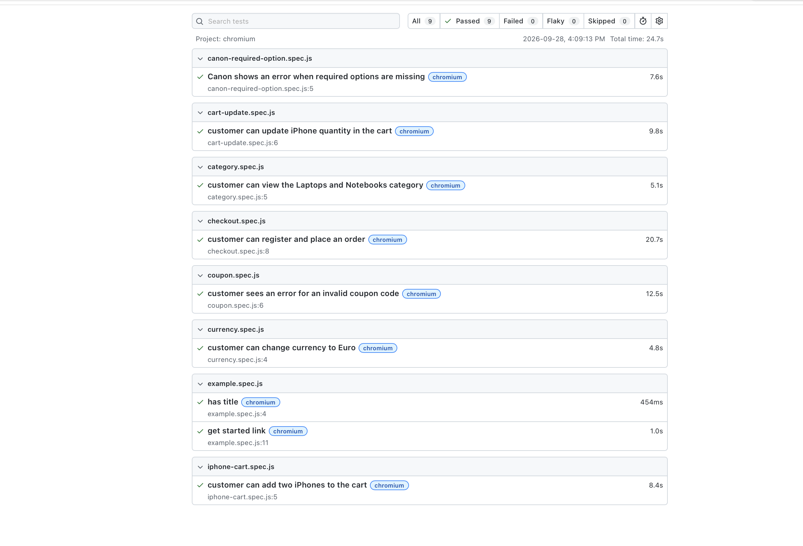

# Playwright Automation Project

This project contains end-to-end UI automation tests for the Tutorial Ninja demo e-commerce website using Playwright.

## Application Under Test

[Tutorial Ninja Demo Store](https://tutorialsninja.com/demo/)

## Test Scenario

The automated test performs the following actions:

1. Launch the Tutorial Ninja application.
2. Change the store currency to Euro.
3. Attempt to add a Canon EOS 5D camera to the cart.
4. Capture and print the error message caused by not selecting a required option.
5. Return to the home page.
6. Open the iPhone product details page.
7. Change the iPhone quantity to 2.
8. Add the iPhone to the cart.
9. Print the successful add-to-cart message in the console.
10. Open the mini cart and select **View Cart**.
11. Change the iPhone quantity to 3.
12. Update the shopping cart.
13. Print the Eco Tax and VAT amounts in the console.
14. Select **Checkout**.
15. Print the error message and remove the product from the cart.
16. Navigate to **Laptops & Notebooks**.
17. Open the HP laptop product.
18. Verify that the default quantity is 1.
19. Add the HP laptop to the cart.
20. Verify the success message.
21. Open the shopping cart.
22. Apply coupon code `ABCD123`.
23. Print the coupon error message.
24. Enter gift certificate code `AXDFGH123`.
25. Apply the gift certificate and print the error message.
26. Clear the coupon and gift certificate text fields.
27. Continue to checkout.
28. Select the **Register Account** option.
29. Enter customer, account, billing, and shipping details.
30. Accept the required terms and conditions.
31. Complete checkout and confirm the order.
32. Verify that the order confirmation message is displayed.
33. Return to the home page.

## Project Structure

```text
playwright-automation/
├── .github/
│   └── workflows/
├── pages/
│   ├── CategoryPage.js
│   ├── CheckOutPage.js
│   ├── HomePage.js
│   └── ProductPage.js
├── test-data/
│   └── checkout-data.json
├── tests/
│   └── order.spec.js
├── .gitignore
├── package-lock.json
├── package.json
└── playwright.config.js
```

## Technologies Used

- JavaScript
- Node.js
- Playwright
- GitHub
- GitHub Actions

## Installation

Clone the repository:

```bash
git clone <your-repository-url>
```

Move into the project folder:

```bash
cd playwright-automation
```

Install project dependencies:

```bash
npm install
```

Install Playwright browsers:

```bash
npx playwright install
```

## Run Tests

Run all Playwright tests:

```bash
npx playwright test
```

Run tests with the browser visible:

```bash
npx playwright test --headed
```

Run one specific test file:

```bash
npx playwright test tests/order.spec.js
```

## View Test Report

After running the tests, open the Playwright HTML report:

```bash
npx playwright show-report
```

## Test Data

Customer and billing details are stored in:

```text
test-data/checkout-data.json
```

A unique email address is generated during every test run to prevent registration failures caused by an email address that already exists.

## Project Design

This project uses the Page Object Model (POM) design pattern.

- `HomePage.js` contains home page actions and locators.
- `ProductPage.js` contains product page actions and locators.
- `CategoryPage.js` contains category navigation actions and locators.
- `CheckOutPage.js` contains cart, registration, checkout, payment, and order confirmation actions.
- `order.spec.js` contains the end-to-end test scenario.
- `checkout-data.json` stores reusable customer data.
## Test Report Screenshot

The screenshot below shows the Playwright HTML test report after the test execution.


## Ignored Files

The following files and folders should be included in `.gitignore`:

```gitignore
node_modules/
test-results/
playwright-report/
blob-report/
.DS_Store
```
